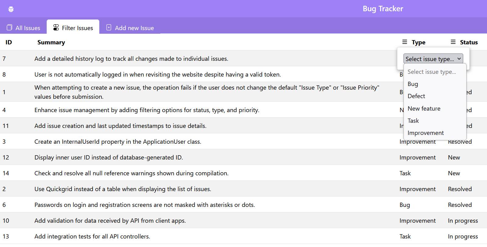
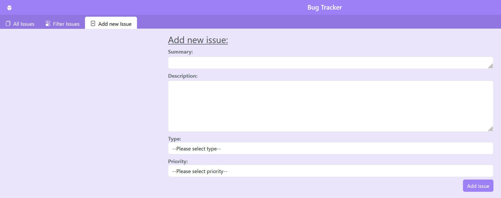
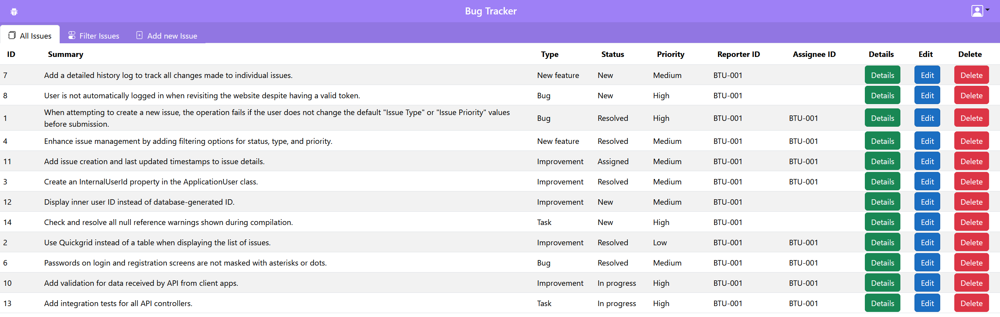

# 🐞 zBug – Bug Tracker System
zBug is a web-based application designed to help teams track and manage software project issues—including bugs, new features, improvements, and tasks. 
It streamlines collaboration and enhances overall project organization.

## Screenshots

  
  
  

## Features
- 📝 Create, edit, and delete bug reports
- 👥 Assign issues to team members
- ⏱ Track bug status: Open, In Progress, Resolved, Closed
- 🔎 Search and filter bugs by keywords, status, and assignee
- 🛡 Role-based access control (Admin, Developer, Tester)

## Built With
- Backend: C# / ASP.NET Core MVC / Entity Framework Core
- Database: PostgreSQL
- Frontend: Blazor WebAssembly / HTML / CSS
- Authentication: ASP.NET Core Identity / JWT
- Containerization: Docker
- Testing: xUnit
- Other Tools: OpenAPI (Swagger), AutoMapper, Mediator Pattern (MediatR), NSwag, RESTful API

### Future Improvements
- Dashboard overview with bug statistics
- File attachments for bug reports
- Email/Slack notifications
